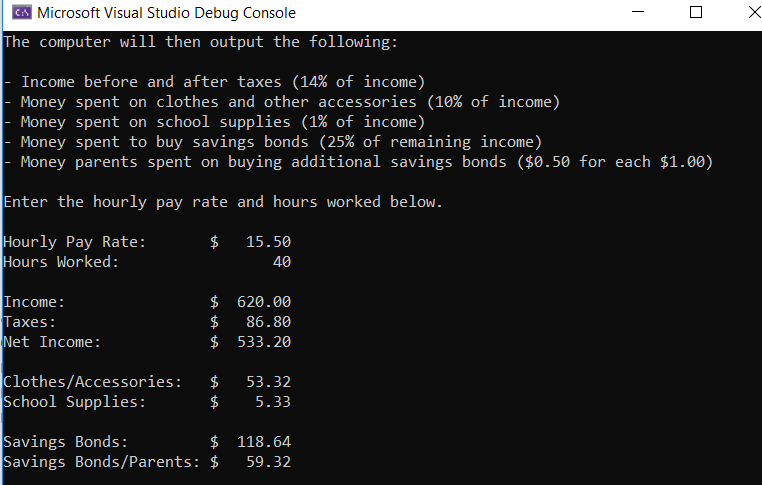
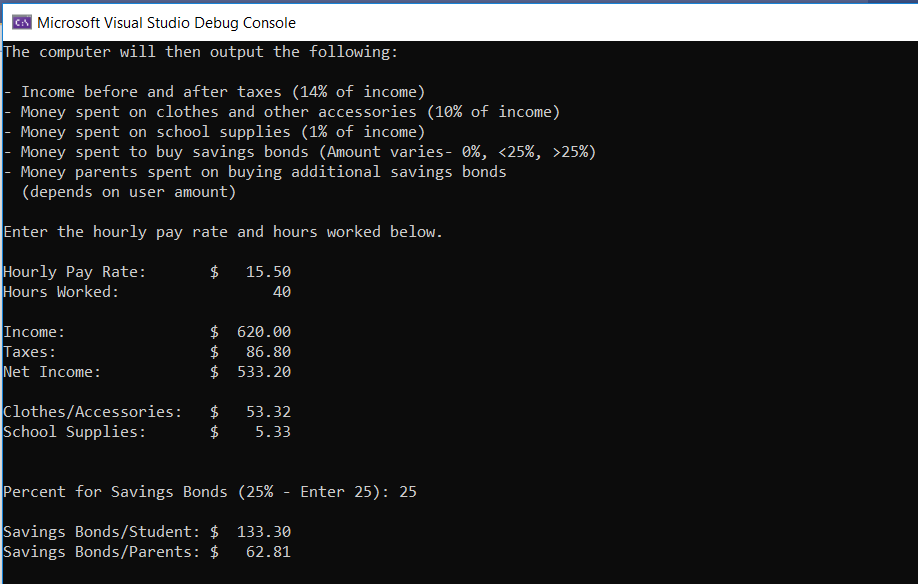

# Midterm_Projects_Cpp_I
 C++ - Semester I - Projects
 
 
 
## Midterm Project 1 - Savings Bond (set amount)
The program will ask the user for the pay rate and hours worked.

The program will then output the following:
* Income before and after taxes (14% of income)
* Money spent on clothes and other accessories (10% of income)
* Money spent on school supplies (1% of income)
* Money spent to buy savings bonds (25% of remaining income)
* Money parents spent on buying additional savings bonds ($0.50 for each $1.00)

## Midterm Project 2 - Savings Bond (variable amount)
The program will ask the user for the pay rate and hours worked.

The program will then output the following:
* Income before and after taxes (14% of income)
* Money spent on clothes and other accessories (10% of income)
* Money spent on school supplies (1% of income)
* Money spent to buy savings bonds (Amount varies- 0%, <25%, >25%)
* Money parents spent on buying additional savings bonds (depends on user amount)

## Midterm Project 3 - Loan Repayment Calculator Part A
The program will ask the user to enter the following:
* loan amount
* interest rate
* monthly payment.

The program will calculate and display the number of months it will take to repay the loan.

## Midterm Project 3 - Loan Repayment Calculator Part B
The program will ask the user to enter the following:
* loan amount
* interest rate
* monthly payment.

The program will calculate and display the following:
* number of months it will take to repay the loan
* amount of last payment
* total interest paid

